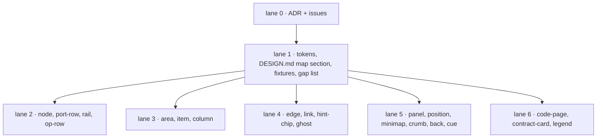

# ADR 0001 · the map is DOM

Date: 2026-09-28 · Status: accepted · Supersedes DESIGN.md rule 6 and HANDOFF.md "Map primitives: not components".

## Context

sett's first cut said the map (repo board, units, the inside of a unit) was drawn by a WebGL layer in arch that reads `tokens.rs`; sett shipped values and a static SVG legend only (#14). The arch map proof of concept then built the whole map in plain DOM and ran it on three real repositories (ripgrep, zero2prod, Zed). Its handoff asks sett to ship the map as Lit elements with stories.

Rule 6 and the handoff cannot both hold. Seven points where the PoC's CSS and DESIGN.md disagreed were rendered on real `sett.css` and judged one by one; the record is `docs/superpowers/specs/2026-09-28-map-design.md`.

## Decision

1. **The map is DOM.** Every map thing is a `sett-*` Lit element reading tokens as CSS variables. `tokens.rs` keeps being generated for any future GPU layer, but nothing in sett depends on one existing.
2. **The PoC is the source for geometry and semantics**: sizes, thresholds, the kind table, the method table, the status table, the ten rules and the rejected list.
3. **sett wins on look where the two disagree**: no toast (a panel status line instead), sett's lifted dark accents, lowercase mute section headers, and a motion budget of camera fit (300 ms), tier swap (150 ms cross-fade) and flow dash on the selected unit's edges only. No hover transitions.
4. **The map surface is the chrome's cool grey** with the PoC's four column tints; the warm `map.*` tokens are removed.
5. **Names**: the ghost neighbour is `sett-ghost`, the tab strip is the existing `sett-tabbar`, the border hint is `sett-hint-chip`.

## Consequences

- DESIGN.md changes in lane 1: the opening line (one material, not two), rule 6, the motion list, and a new section "the map" with the ten rules and the rejected list.
- One honest consequence: a very large repository may stall the DOM. The handoff keeps performance budgets out of scope, so that risk stays with arch, not sett.
- Every map story runs through the a11y gate in both themes; the PoC's dark accents would have failed it, which is why they were replaced.
- The PoC and sett disagree on four dark hex codes and on header case until the PoC is re-exported from the tokens; the gap list issue carries that back to the arch chat.

## Lanes

Issues: ADR #34 · lane 1 #35 · lane 2 #36 · lane 3 #37 · lane 4 #38 · lane 5 #39 · lane 6 #40 · gap list #41.

